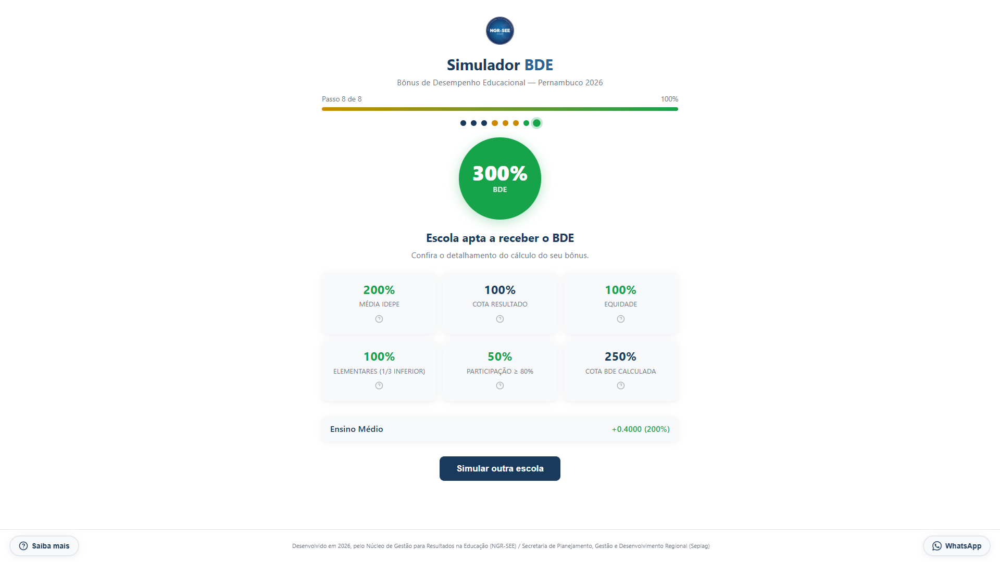

# Simulador BDE — NGR-SEE



Sistema interativo para simulacao do Bonus de Desempenho Educacional (BDE) de Pernambuco.

## O que e?

O Simulador BDE foi desenvolvido pelo Nucleo de Gestao para Resultados na Educacao (NGR-SEE) / Seplag para facilitar a vida dos gestores escolares. Antes, o calculo do BDE era feito manualmente em planilhas Excel. Agora, basta preencher os dados em um passo a passo guiado e o sistema faz todo o calculo automaticamente.

## Funcionalidades

- **Wizard passo a passo**: navegacao intuitiva em etapas
- **Calculo automatico**: formula exata da planilha original
- **Resultado detalhado**: visualizacao de cada componente do BDE
- **Explicacoes interativas**: clique nos cards do resultado para entender cada metrica
- **Contato integrado**: WhatsApp para suporte

## Como executar

```bash
cd "D:\exemplo\mudar-caminho"
python -m uvicorn main:app --reload
```

Acesse: http://127.0.0.1:8000

## Stack

- **Backend**: FastAPI + Python
- **Frontend**: HTML + CSS + JavaScript vanilla
- **Templates**: Jinja2
